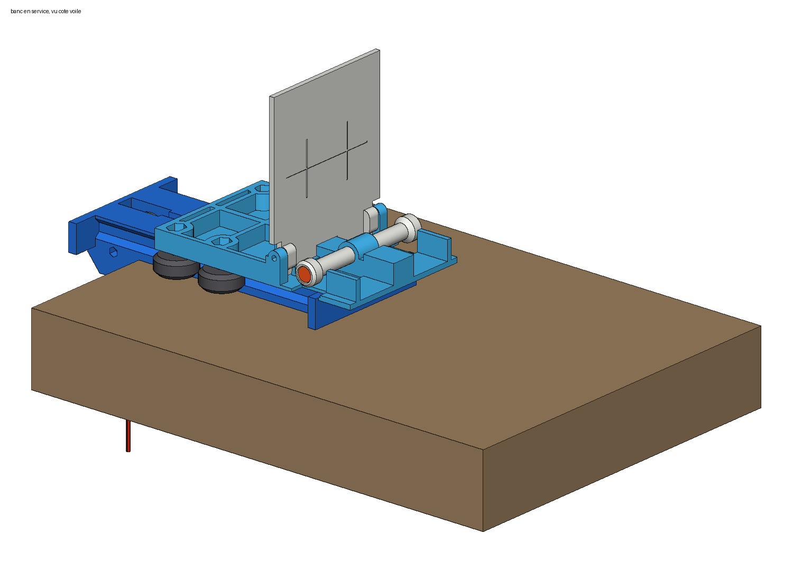
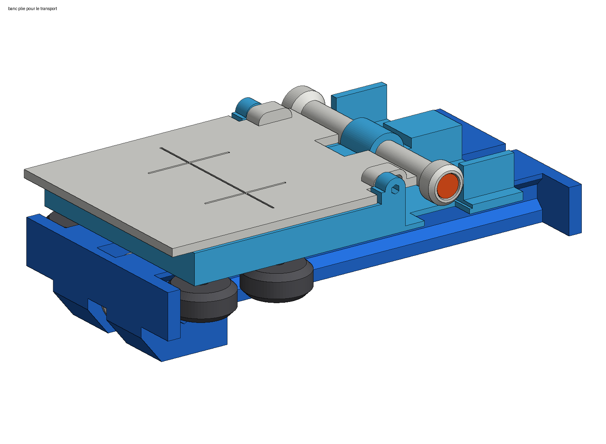

# Notes de conception du banc de calage

Ce document rassemble le détail : choix de conception, cotes, prix relevés, vérifications,
variantes écartées. La présentation courte est dans [README.md](README.md).

Un petit bloc imprimé qui se pose sur le bord d'une table, sur le principe de l'EasyTrim :
il met la suspente sous 5 kg et présente une cible au télémètre laser. La cible se rabat
à plat pour le transport.

| En service | Plié |
|---|---|
|  |  |

Autres vues : [côté poche à eau](apercu/banc_ouvert_arriere.png),
[profil ouvert](apercu/banc_ouvert_profil.png), [profil plié](apercu/banc_plie_profil.png).

## Principe

- Le **socle** s'accroche au chant de la table par deux crochets. Aucune fixation : c'est la
  tension de la suspente qui le plaque contre le bord.
- La **poulie** tourne sur un roulement à billes, autour d'une vis M5 qui traverse
  les deux crochets. Elle est logée dans le bloc des crochets, sous le passage du
  coulisseau : la cordelette monte de la poche à eau, passe sur la poulie et rejoint le
  coulisseau par un canal creusé dans le dessus du socle. Rien ne dépasse du socle, et les
  rainures des roues passent au-dessus des crochets : c'est ce qui rend le banc court.
- Les **fins de course** sont deux butées relevées aux deux bouts du socle, contre lesquelles
  les roues s'arrêtent. Le coulisseau ne peut pas sortir de ses rainures.
- Le **coulisseau** roule sur le socle par 4 roues à gorge en V montées sur des vis M5.
  Les roues s'engagent dans deux rainures en V taillées dans les flancs du socle : le
  coulisseau ne peut ni se soulever ni se mettre de travers.
- Les **élévateurs** s'accrochent à l'avant du coulisseau, posés à plat, chacun sur une
  bobine, de part et d'autre d'une nervure centrale. La boucle de base de l'élévateur se
  passe par-dessus le chapeau de la bobine, sans rien dévisser, puis la sangle se couche
  dans son couloir, entre la nervure et une joue : elle ne peut pas glisser de côté. Rien ne
  se démonte à l'usage, donc rien ne se perd, et la sangle ne touche que du plastique lisse
  (la vis qui porte les bobines est noyée dedans). La traction passe par tout l'élévateur,
  comme en vol.
- La **cible** est articulée à l'avant du coulisseau, juste derrière les bobines. Relevée et
  poussée vers le bas, sa languette se coince entre la face avant du coulisseau et une lèvre
  inclinée : elle est verrouillée d'équerre et ne peut basculer ni en avant ni en arrière.
  Pour la rabattre, on la soulève de 5,5 mm puis on la couche sur le coulisseau. Une mire
  gravée indique où viser.
- Côté voile, le **support du laser** coince la patte d'attache dans l'encoche de son bec, et
  le laser couché dedans vise la cible. **Longueur = lecture + constante**, la constante
  étant étalonnée une fois.

Quand le coulisseau flotte entre ses deux butées, la suspente est tendue au poids de la
poche. Deux choses pourraient fausser cette tension, et le banc est dessiné pour les rendre
négligeables :

- **le frottement de la poulie** : elle tourne sur un roulement à billes, pas sur un simple
  axe (un axe lisse dans du plastique mangerait de l'ordre de 10 % de la tension, dans un
  sens puis dans l'autre) ;
- **l'inclinaison de la cordelette** : la poulie étant sous le coulisseau, le brin monte de
  6 mm jusqu'à son attache. Celle-ci est placée le plus en avant possible du coulisseau, si
  bien que la tension réelle vaut 99,2 % du poids en butée arrière, 99,8 % à mi-course et
  99,9 % en fin de course (calcul géométrique, non mesuré).

## Encombrement

| | Longueur | Largeur | Épaisseur |
|---|---|---|---|
| Plié | 164 mm | 93 mm | 52 mm (dont 14 mm de crochets) |
| En service | 164 mm, plus l'avancée du coulisseau | 93 mm | 136 mm |

Course du coulisseau : 100 mm. La longueur du banc vaut course + entraxe des roues + 34 mm
(un diamètre de roue et les deux butées de 5 mm) ; les 34 mm de crochets devant la table sont
compris, puisque les rainures passent au-dessus. On peut échanger course et entraxe dans
`banc.scad` :

| Entraxe des roues (`wheel_px`) | Course (`travel`) | Longueur du banc |
|---|---|---|
| **30 mm (réglage actuel)** | **100 mm** | **164 mm** |
| 40 mm | 100 mm | 174 mm |
| 30 mm | 150 mm | 214 mm |

Au repos et plié, tout tient dans la longueur du socle : le coulisseau (130 mm) reste
au-dessus, et la cible rabattue ne dépasse pas à l'arrière. En bout de course côté voile,
l'avant du coulisseau dépasse du socle de 75 mm, au-dessus de la table.

L'entraxe de 30 mm est le plus court raisonnable : en dessous de 28 mm, les roues se
toucheraient. Un entraxe court guide un peu moins bien le coulisseau quand un seul élévateur
tire, donc de travers ; si cela se voit à l'usage, repasser à 40 mm coûte 10 mm de longueur.

Deux variantes plus courtes ont été essayées puis écartées :

- 149 mm, roues fixées sur le socle et coulisseau en tiroir : plus épaisse de 8 mm,
  coulisseau en deux pièces qui dépasse derrière la table au repos. Son modèle reste dans
  `scad/banc_149mm.scad`, sans STL.
- 146 mm, sans butées en bout de socle, le coulisseau étant arrêté par une goupille circulant
  dans le canal de la cordelette. Non conservée.

## Pièces imprimées (`stl/`)

| Fichier | Pièce | Aperçu | Volume |
|---|---|---|---|
| `socle.stl` | socle, butées, crochets de table, logement de la poulie, canal de la cordelette | [image](apercu/socle.png) | 101 cm³ |
| `coulisseau.stl` | plaque mobile, couloirs des élévateurs, lèvre de verrouillage, oreilles de charnière | [image](apercu/coulisseau.png) | 58 cm³ |
| `poulie.stl` | poulie Ø25, avec le logement du roulement 625 | [image](apercu/poulie.png) | 2 cm³ |
| `cible.stl` | cible articulée 84 × 101, avec mire gravée | [image](apercu/cible.png) | 25 cm³ |
| `bobine_tete.stl` | bobine dont le chapeau loge la tête de vis | [image](apercu/bobine_tete.png) | 2 cm³ |
| `bobine_ecrou.stl` | bobine dont le chapeau loge l'écrou frein | [image](apercu/bobine_ecrou.png) | 2 cm³ |
| `entretoises_grappe.stl` | les 8 entretoises (4 pour les roues, 2 pour la poulie, 2 de rechange) réunies par une barrette, à détacher au cutter | [image](apercu/entretoises_grappe.png) | 1 cm³ |
| `support_laser_<modèle>.stl` | support du télémètre, côté voile, avec son bec à encoche ; une version par télémètre | [en service](apercu/support_laser_arriere.png), [le bec](apercu/support_laser_bec.png) | ≈ 20 à 50 cm³ |

Une pièce par fichier, chaque fichier à imprimer une fois ; seules les entretoises sont
groupées, parce qu'un service d'impression refuse les pièces minuscules.

Toutes sortent orientées pour l'impression, sans support : socle dessus contre le plateau,
coulisseau dessous contre le plateau, cible dos contre le plateau, poulie à plat, bobines
debout sur leur tube, entretoises à plat, support du laser debout sur la face avant de son
bec.

Pour un objet qui voyage : PETG (ou ASA), 4 périmètres, 25 % de remplissage. Cible en blanc
mat de préférence.

Les modèles paramétriques sont `scad/banc.scad` (variable `part` pour choisir la pièce,
`plie = true` pour voir l'assemblage rabattu) et `scad/support_laser.scad`.

## Support du laser

Repris de votre « TEST.stl », même principe : le télémètre est couché dans une auge ouverte
à l'avant ; sous l'avant, un bec plat descend sous le fond et porte une encoche. On y glisse
la suspente par en dessous, sa patte d'attache (ou son nœud), trop grosse, bute contre le
bec : sous 5 kg, la suspente reste dans l'axe du faisceau. Vues :
[en service, vu de l'arrière](apercu/support_laser_arriere.png), [le bec](apercu/support_laser_bec.png).

- **Cotes du télémètre en paramètres** : `laser_w`, `laser_l`, `laser_h` (largeur, longueur,
  épaisseur), à mesurer au pied à coulisse. Les valeurs par défaut (34,5 × 78,5 × 18 mm) sont
  celles de votre TEST.stl, pas celles d'un télémètre précis : les remplacer par les vôtres.
- **Moins épais que le télémètre** : les parois s'arrêtent `moins_epais` (3 mm) sous le dessus
  du télémètre, pour le saisir et atteindre ses boutons.
- **Boutons sur le côté** : `btn_cote` (0 aucun, 1 droite, -1 gauche, 2 les deux) abaisse la
  paroi en face des boutons, entre `btn_y0` et `btn_y0 + btn_len` depuis la face arrière du
  télémètre, en ne laissant que `btn_h` (4 mm) de paroi.
- **Encoche** : 3 mm de large (`slit_w`), entrée en V, fond rond : toutes les suspentes
  passent, la patte d'attache ou son nœud non. Le bec garde la forme et l'épaisseur (4 mm)
  de TEST.stl ; une première version avec une bande de renfort derrière le bec a été
  retirée le 7 octobre 2026 : elle débordait sous le fond.
- **Offset** : l'outil de calage attend la distance entre l'axe d'accrochage de l'élévateur
  et la cible. L'élévateur entier est pris sur la bobine ; la face visée de la cible
  (`sl_front + tg_t` = 51) est 21 mm derrière l'axe des bobines (`sl_front + pin_x` = 72),
  vu du laser. Offset = 21 mm, le télémètre réglé « mesure depuis l'avant » (sa face avant
  affleure le bec, au jeu `fit` près).
- **Versions** : une par télémètre de `outils/lasers.json` (Leica DISTO et Bosch à moins de
  500 €, cotes constructeur) ; `node outils/generer_stl.mjs lasers` regénère les STL et le
  tableau du README.
- Deux rainures pour un élastique qui tient le télémètre, un trou de dragonne dans la face
  arrière, 21 cm³.

**Matière recommandée : PETG** (ou ASA) sur votre imprimante ou au fablab, 4 périmètres,
25 % de remplissage, comme le reste du banc. Chez JLC3DP : **nylon 3201PA-F**. Pas de résine
pour cette pièce : le bec travaille en tension et prend des chocs, et la résine casse au
lieu de plier.

## Ce qu'il faut acheter

Prix indicatifs relevés en ligne ou estimés ; à vérifier au moment de la commande.

| Pièce et dimensions | Qté (1 banc / 10) | Prix relevé | Lien |
|---|---|---|---|
| Roue V pour profilé V-slot, POM, Ø 24 × 10,2 mm, alésage 5 mm, 2 roulements 625ZZ montés | 4 / 40 | 12,90 € le lot de 6 | [3delectroshop.fr](https://3delectroshop.fr/roulements-et-rotules/504-roulettes-v-slot-en-pom-avec-roulements-625zz.html) ; par lots : [AliExpress](https://fr.aliexpress.com/item/1005001588321075.html) |
| Vis à tête bombée six pans creux M5 × 25, ISO 7380, filetée sur toute la longueur, tête Ø 9,5 × 2,75 mm, clé de 3 (roues) | 4 / 40 | 0,08 € pièce | [visseriefixations.fr](https://www.visseriefixations.fr/vis-a-six-pans-creux/tete-bombee-hexagonale-creuse/tbhc-inox-a2-iso-7380/tbhc-m5x25-inox-a2-iso-7380.html) |
| Roulement à billes 625ZZ, 5 × 16 × 5 mm (poulie) | 1 / 10 | 0 € pour un banc : le prendre sur une des 2 roues en trop du lot de 6 ; sinon 1,10 € pièce | [reprap-france.com](https://www.reprap-france.com/produit/1234568282-roulement-a-billes-625zz) |
| Vis à tête cylindrique six pans creux M5 × 40, DIN 912, tête Ø 8,5 × 5 mm, clé de 4, tige lisse sur ≈ 18 mm (axe de poulie) | 1 / 10 | 0,13 € pièce | [visseriefixations.fr](https://www.visseriefixations.fr/vis-a-six-pans-creux/tete-cylindrique-hexagonale-creuse/inox-a2/tchc-inox-a2-filetage-partiel-din-912/tchc-m5x40-inox-a2-pf-din-912.html) |
| Vis à tête cylindrique six pans creux M5 × 80, DIN 912, tête Ø 8,5 × 5 mm, clé de 4 (bobines) | 1 / 10 | 0,59 € pièce | [visseriefixations.fr](https://www.visseriefixations.fr/vis-a-six-pans-creux/tete-cylindrique-hexagonale-creuse/inox-a2/tchc-inox-a2-filetage-partiel-din-912/tchc-m5x80-inox-a2-pf-din-912.html) |
| Écrou frein à bague nylon M5, DIN 985, 8 mm sur plats, hauteur 5 mm (roues, bobines et poulie) | 6 / 60 | 0,04 € pièce | [visseriefixations.fr](https://www.visseriefixations.fr/ecrous/ecrous-autofreines/ecrou-hexagonal-autofreine-nylstop/ecrou-nylstop-inox-a2-din-985/ecrou-nylstop-m5-inox-a2-din-985-99867-99867.html) |
| Vis à tête bombée six pans creux M3 × 12, ISO 7380, tête Ø 5,7 × 1,65 mm, clé de 2 (charnières) | 2 / 20 | 0,05 € pièce | [visseriefixations.fr](https://www.visseriefixations.fr/vis-a-six-pans-creux/tete-bombee-hexagonale-creuse/tbhc-inox-a2-iso-7380/tbhc-m3x12-inox-a2-iso-7380.html) |
| Écrou frein à bague nylon M3, DIN 985, 5,5 mm sur plats, hauteur 4 mm (charnières) | 2 / 20 | 0,04 € pièce | [visseriefixations.fr](https://www.visseriefixations.fr/ecrous/ecrous-autofreines/ecrou-hexagonal-autofreine-nylstop/ecrou-nylstop-inox-a2-din-985/ecrou-nylstop-m3-inox-a2-din-985-17062-17062.html) |
| Cordelette Ø 2 mm, longueur 1,5 m | 1 / 10 | 0 € | reste de suspente, drisse, paracorde |
| Lest de 5 kg | 1 / — | 0 € | votre poche à eau, ou un bidon d'eau de 5 L à poignée |
| Sangle velcro 20 mm | — | 0 € | fonds de tiroir |
| **Visserie d'un banc** | | **1,46 €, hors port** | |
| Impression des 7 fichiers du banc et du support (≈ 210 cm³, ≈ 130 g de PETG ; plus grande pièce 164 × 80 × 31 mm) | 1 / 10 | 5–25 € | fablab, ou [devis JLC3DP](https://jlc3dp.com/3d-printing-quote) |
| Télémètre Bluetooth HOTO QWCJY001, 99,5 × 44,1 × 23,3 mm, 30 m, ±2 mm | 1 | 35–39 € | [ulen.eu](https://ulen.eu/fr/product/hoto-qwcjy001-telemetre-laser-bluetooth/), [domotique-store.fr](https://www.domotique-store.fr/maison/outillage/4240-metre-laser-intelligent-bluetooth-hoto-qwcjy001.html), [AliExpress](https://www.aliexpress.com/i/1005002004493544.html) |

Prix relevés sur les pages produit le 4 octobre 2026, ceux de la visserie et des roues relus
le 8 ; les frais de port ne sont pas vérifiés (ils ne s'affichent que dans le panier).
Le lot de 5 roues d'aboutfilament.fr (8,49 €) était en rupture le 4 ; celui de
3delectroshop.fr était en stock le 8 (4 lots).

**Toute la visserie sur un seul site européen : visseriefixations.fr**, à l'unité, sans
minimum de commande affiché. Recherche du 8 octobre 2026 sur une douzaine de sites :

- **Aucun des sites examinés n'a à la fois les roues V et la visserie à l'unité.** Il faut
  deux commandes.
- **bricovis.fr** a les mêmes références aux mêmes prix : c'est l'équivalent exact.
- **vis-express.fr** a tout aussi, nettement plus cher.
- Stock immédiat lu le 8 octobre : 350 vis M5 × 40 et 7 898 écrous frein M3 ; celui des vis
  M3 × 12 ne s'est pas affiché.
- La vis M5 × 25 peut y être livrée en filetage total ou partiel, la norme ne le fixant
  pas : les deux conviennent, l'écrou est au bout. La M5 × 80 n'existe qu'en filetage partiel
  (≈ 22 mm), ce qui convient aussi.
- Autre source de roues : roboter-bausatz.de, lot de 5 à 7,39 € (Ø 23,89 × 10,23, roulements
  625ZZ), mais 14,99 € de port vers la France.

Le chemin le moins cher : roues sur AliExpress (≈ 3 €), la visserie à l'unité en
quincaillerie (≈ 4 €), impression dans un fablab (≈ 5 €), cordelette et lest de récupération,
soit **≈ 12 € de banc**, plus le télémètre (≈ 25 € en promotion).

Ce qui a fait baisser la facture :

- **Le roulement de la poulie ne coûte rien** pour un seul banc : les roues se vendent par
  lot de 6, il en reste deux, et chacune contient deux roulements 625 qui se chassent à la
  main ou avec une vis.
- **L'axe de poulie est une vis M5 × 40** et son écrou frein, noyés dans les crochets.
- **Plus aucune rondelle à acheter** : les rondelles M5 sont remplacées par 6 entretoises
  imprimées (4 pour les roues, 2 pour la poulie), fournies dans `entretoises_grappe.stl` avec
  deux de rechange ; la
  rondelle M4 du nœud est supprimée.
- **Charnière sur deux vis M3 × 12** et leurs écrous frein, et **bobines sans rondelle**.
- **Ni colle ni frein-filet** : partout une vis dans un trou de passage et un écrou frein
  au bout.
- **Pas de mousqueton ni de Dyneema neuve** : n'importe quelle cordelette de 2 mm tient 5 kg ;
  elle se noue directement à la poignée du lest.
- **Lest** : la poche à eau que vous avez déjà, ou un bidon d'eau du commerce.
- **Socle évidé** par-dessous.

Ce qui reste cher, et pourquoi je n'y ai pas touché :

- **Le télémètre** pèse plus que tout le banc. Je n'ai pas trouvé de modèle Bluetooth vérifié
  moins cher que le HOTO ; les modèles à 12–18 € n'ont pas le Bluetooth. Il est vu de
  21 $ (promotion Amazon aux États-Unis) à 38 $ sur AliExpress : surveiller les promotions.
- **L'impression par un service en ligne** : c'est le port, plus que le plastique, qui fait
  le prix. Un fablab ou une imprimante prêtée ramène ce poste à ≈ 5 €.

### Tout acheter sur AliExpress : annonces qui ont des avis

Relevé du 5 octobre 2026 (vis M5 × 40, vis et écrous M3 : du 8). Pour chaque annonce, j'ai lu la note, le nombre
d'avis et les variantes que les acheteurs ont notées. **Vérifiez sur la page que la taille
existe et notez le prix** avant de commander.

| Pièce | Variante à choisir | Qté pour 1 banc | Avis | Lien |
|---|---|---|---|---|
| Roue V noire en POM, Ø 23,9 × 10,23 mm, alésage 5 mm, avec ses 2 roulements 625 | « 10PC BigBlack Wheel » (lot de 10) | 5 (4 roues + 1 pour le roulement de la poulie) | 4,9 / 5 sur 88 avis, dont 46 sur cette variante | [roues, lot de 10](https://fr.aliexpress.com/item/1005003090749056.html) |
| Vis à tête bombée six pans creux ISO 7380, inox, M5 × 25 (roues) | « 10Pcs M5x25 » | 4 | 4,8 / 5 sur 64 avis, dont 2 sur cette variante | [vis tête bombée M3 à M5](https://fr.aliexpress.com/item/32850409234.html) |
| Vis à tête bombée six pans creux ISO 7380, inox, M3 × 12 (charnières) | « 30Pcs M3x12 » | 2 | même annonce, 3 avis sur cette variante | [vis tête bombée M3 à M5](https://fr.aliexpress.com/item/32850409234.html) |
| Vis à tête cylindrique six pans creux DIN 912, inox 304, M5 × 80 (bobines) | « M5 10 pièces », longueur « 80 mm » | 1 | 4,9 / 5 sur 1 535 avis | [vis DIN912 HZYUEGOU](https://fr.aliexpress.com/item/32968483467.html) |
| Vis à tête cylindrique six pans creux DIN 912, inox 304, M5 × 40 (axe de poulie) | « M5 10 pièces », longueur « 40 mm » | 1 | même annonce, 5 avis sur cette variante parmi les 400 derniers | [vis DIN912 HZYUEGOU](https://fr.aliexpress.com/item/32968483467.html) |
| Écrou frein à bague nylon DIN 985, inox 304, M5 | « M5 X 50pcs » | 6 | 5,0 / 5 sur 22 avis, dont 3 sur cette variante | [écrous frein M2 à M20](https://fr.aliexpress.com/item/1005002375633274.html) |
| Écrou frein à bague nylon DIN 985, inox 304, M3 | « M3 X 50pcs » | 2 | même annonce, 5 avis sur cette variante | [écrous frein M2 à M20](https://fr.aliexpress.com/item/1005002375633274.html) |
| Cordelette de 2 mm (paracorde à une âme) | « 10 meters », couleur au choix | 1,5 m | 4,9 / 5 sur 108 avis | [paracorde 2 mm](https://fr.aliexpress.com/item/1005011930498059.html) |

Les goupilles des relevés précédents ont disparu de la liste : voir « Des vis et des écrous,
plus de goupilles ». Les trois lignes ajoutées viennent des annonces déjà retenues, donc sans
port supplémentaire.

La même liste, à cocher, est sur une page à part : <https://claude.ai/artifact/KuYeWNqA6emn3GKmHpZLea>
(page privée, ouverte avec votre compte Claude).

**Prix lus sur les annonces le 5 octobre 2026**, dans le navigateur, sans compte, pour une
livraison en France :

| Ligne | Prix lu |
|---|---|
| Roues « 10PC BigBlack Wheel », lot de 10 | 6,69 € |
| Vis M5 × 25 tête bombée, lot de 10 | 4,29 € |
| Écrous frein M5, lot de 50 | 3,39 € |
| Vis M5 × 80, lot de 10 | 5,09 € |
| Cordelette 2 mm, 10 m | 1,62 € |
| Vis M5 × 40, lot de 10 (lu le 8 octobre) | 3,09 € |
| Vis M3 × 12 tête bombée, lot de 30 (lu le 8 octobre) | 3,69 € |
| Écrous frein M3, lot de 50 (lu le 8 octobre) | 2,26 € |
| **Quincaillerie, tout compris** | **30,12 €**, livraison gratuite (articles « Choice », plus de 10 €) |

Une réserve :

- **Télémètre** : l'annonce HOTO que j'avais retenue n'est plus vendue en France (page
  introuvable). Une recherche montre un télémètre du même format à 29,39 €, noté 4,8, que je
  n'ai pas vérifié (marque, Bluetooth). Les revendeurs européens du tableau plus haut
  restent valables, à 35–39 €.

- **Roulement de la poulie** : il se prend sur la cinquième roue du lot de 10.
- **Sur les roues**, vérifiez à réception la largeur sur les deux roulements : le modèle
  compte 11 mm (paramètre `wheel_stack`).

### Prises de filet vérifiées

Calculées sur le modèle, vis par vis.

| Vis | Empilage sous la tête | Écrou | Bout de la vis |
|---|---|---|---|
| M5 × 25 des roues (×4), filetée sur toute la longueur | roue 11,0 (sur ses deux roulements) + entretoise 2,7 + coulisseau 5,3 = 19,0 mm | frein de 5 mm : de 19,0 à 24,0 | dépasse l'écrou de 1 mm (bague nylon en prise), reste 0,2 mm sous le dessus du coulisseau |
| M5 × 80 des bobines (×1) | bobine 29,25 + nervure 16 + bobine 28,25 = 73,5 mm | frein de 5 mm : de 73,5 à 78,5 | dépasse l'écrou de 1,5 mm (bague nylon en prise), reste 0,5 mm à l'intérieur du chapeau |
| M5 × 40 de la poulie (×1) | d'un fond de logement à l'autre : 50 − 9,5 − 6,5 = 34,0 mm | frein de 5 mm : de 34,0 à 39,0 | dépasse l'écrou de 1 mm (bague nylon en prise), reste 0,5 mm sous le flanc |
| M3 × 12 des charnières (×2) | 2,0 mm d'oreille | frein de 4 mm, logé dans l'oreille : de 2,0 à 6,0 | dépasse l'écrou de 6 mm : 0,4 mm de jeu, puis 5,6 mm dans la lumière du charnon, profonde de 6,5 |

**La vis des roues doit être filetée sur toute sa longueur, et ce n'est pas une erreur.**
L'écrou est tout au bout, donc il faut du filet au bout ; et en M5 × 25, les vis ISO 7380
n'existent qu'entièrement filetées. Les deux roulements de la roue reposent donc sur le
filet, ce qui ne gêne pas : leurs bagues intérieures sont serrées entre la tête de vis et
l'entretoise, elles ne tournent pas sur la vis. C'est le montage d'origine de ces roues
(OpenBuilds). La poulie tourne sur son roulement, la cible sur le bout de ses vis M3.

Il faut du filet sur les 7 derniers millimètres de la M5 × 80 : une DIN 912 normale en a 22.

Deux corrections sont sorties de cette vérification :

- le modèle comptait 10,23 mm pour la roue au lieu de 11 mm sur ses roulements, et la vis ne
  prenait qu'une partie de l'écrou ;
- pour se passer de frein-filet, les roues sont maintenant tenues par des écrous frein. Il a
  fallu une vis de 25 mm au lieu de 20 et un coulisseau de 11,5 mm au lieu de 8.

### Aucune colle

| Assemblage | Ce qui le tient |
|---|---|
| Roues | écrou frein à bague nylon, noyé dans un logement à six pans du coulisseau |
| Bobines des élévateurs | écrou frein noyé dans un chapeau |
| Charnières de la cible | vis M3 × 12 bloquée sur l'oreille, entre sa tête et un écrou frein logé dans la face intérieure ; le charnon voisin empêche l'écrou de ressortir |
| Axe de poulie | vis M5 × 40 et écrou frein, noyés dans les deux crochets |
| Roulement dans la poulie | emmanché dans son logement, retenu par une lèvre |

### Des vis et des écrous, plus de goupilles

Deux systèmes de goupilles ont été essayés puis abandonnés le 8 octobre 2026, parce que leur
tenue restait trop aléatoire :

- des goupilles lisses serrées dans des trous à six pans : le serrage se jouait à 0,05 mm,
  moins que la précision d'une imprimante ;
- des goupilles cannelées DIN 1472 dans des trous ronds : plus tolérantes, mais leur tenue
  dépendait encore du diamètre sorti de l'imprimante, qu'un calibre imprimé devait régler.

Le banc n'a plus que des vis dans des trous de passage (Ø 5,3 pour le M5, Ø 3,3 pour le M3),
chacune arrêtée par un écrou frein à bague nylon. Rien ne dépend plus d'un ajustement : un
trou sorti un peu grand ou un peu petit ne change rien à la tenue.

- **Poulie** : vis M5 × 40 à tête cylindrique. Sa tête (logement Ø 9, profond de 9,5 mm) et
  son écrou frein (logement à six pans, profond de 6,5 mm) sont noyés dans les crochets,
  parce que les roues passent le long des flancs. Le roulement tourne autour de la vis,
  entre ses deux entretoises ; avec une vis à filetage partiel, il porte sur la tige lisse.
- **Charnières** : vis M3 × 12 à tête bombée. La tête porte sur le flanc de l'oreille, et
  l'écrou frein est logé dans sa face intérieure : la vis est bloquée sur l'oreille, et les
  5,6 mm qui dépassent de l'écrou servent d'axe à la cible, dans la lumière du charnon. Le
  charnon, à 0,4 mm de l'oreille, empêche l'écrou de ressortir. La cible tourne et coulisse
  donc sur un bout fileté : c'est moins doux que sur une tige lisse, sans conséquence pour
  une charnière qui ne bouge qu'au pliage.
- Les oreilles ont pris 1 mm de rayon pour loger l'écrou, et leur dessus est arasé 4,5 mm
  au-dessus de l'axe : le banc plié reste à 52 mm. Les têtes des vis de charnière dépassent
  de 1,65 mm de chaque côté, moins que les roues.
- L'axe de la poulie est 1 mm sous le dessus de la table : le logement de la tête de vis
  passe ainsi sous les rainures en V sans amincir le chanfrein où roule la roue.
- Les logements d'écrou ont deux pans horizontaux : ils s'impriment sans support.

Rien de tout cela n'a été imprimé.

### Contrôle avant impression (8 octobre 2026)

Fait sur les fichiers de `stl/`, par calcul : aucun essai, aucune pièce imprimée.

- **Maillages** : les 21 fichiers sont fermés et orientés de façon cohérente.
- **Interférences** : les 14 contrôles de `generer_stl.mjs check` (banc ouvert et plié,
  coulisseau aux deux bouts de sa course) ne trouvent aucun volume commun ; il ne reste que
  les contacts voulus (roues dans leurs rainures, cible contre la face avant, bobines contre
  la nervure).
- **Impression sans support** : le plus long pontage est le fond du canal de la cordelette
  (6 mm) ; viennent ensuite les lumières de la cible (6,1 mm) et les logements d'écrou (4,8
  et 3,35 mm).
- **Parois** : aucune sous 1,2 mm dans le socle ni dans le coulisseau (1,77 et 1,60 mm au
  plus mince). La cible a une cloison de 1,0 mm au fond de chaque lumière, sans rôle
  mécanique ; le chapeau de `bobine_ecrou` descend à 0,7 mm aux angles de son logement
  d'écrou, sur le dernier 1,5 mm, au-dessus de l'écrou.
- **Efforts sous 5 kg** (49 N dans la suspente, 69 N sur l'axe de la poulie), par calcul à
  la main, section par section :

| Endroit | Contrainte calculée |
|---|---|
| Crochets contre le chant de la table | 0,1 MPa |
| Portée de la vis de poulie dans les crochets | 0,7 MPa |
| Matière sous la vis de poulie, au-dessus de l'évidement du crochet | ≈ 2,5 MPa |
| Ailes des butées, coulisseau retenu par les 5 kg | 3,3 MPa |
| Lèvres des rainures sous les roues | ≈ 1,6 MPa |
| Nervure du coulisseau autour de la vis des bobines | 0,6 MPa |
| Vis M5 × 80 des bobines, en flexion (acier) | 46 MPa |
| Vis M5 × 40 de la poulie, en flexion (acier) | 26 MPa |

  Le PETG imprimé casse vers 45 MPa dans le plan des couches et vers 25 MPa entre couches ;
  sous charge permanente, mieux vaut rester sous 5 à 10 MPa. L'inox A2-70 plie à 450 MPa.
  Les pièces sont donc chargées au tiers de cette limite prudente au pire endroit, et bien
  moins ailleurs.
- **Basculement** : le banc tient sur la table par la traction de la suspente. À
  l'horizontale, le moment qui le plaque vaut 1,7 fois celui de la poche à eau. Si la
  suspente monte vers la voile, la marge fond : au-delà de ≈ 6° (10 cm par mètre), coulisseau
  en bout de course, l'avant du banc se soulève.

### Télémètre Bluetooth le moins cher

- **HOTO QWCJY001** (écosystème Xiaomi) : Bluetooth, 30 m, ±2 mm, 99,5 × 44,1 × 23,3 mm,
  recharge USB-C. Vu entre 25 € (AliExpress) et 35–39 € chez des revendeurs européens.
  Les mesures remontent dans l'application Mi Home ; je n'ai pas pu vérifier si elle sait
  exporter une liste de mesures.
- **Mileseey D5T** : Bluetooth, 50 m, ±2 mm, 110 × 50 × 26 mm, application dédiée ;
  vu de 25 à 45 € selon les vendeurs.
- **À éviter pour cet usage** : le Duka LS-P (15–18 €), très bon marché mais sans Bluetooth.
- Quel que soit le télémètre, ses trois cotes se reportent dans `scad/support_laser.scad`.

### Où faire imprimer

- **Fablab ou atelier partagé près de chez vous** : on ne paie en général que la matière et
  une adhésion, soit 5 à 10 € de PETG. Le plus économique et le plus rapide pour corriger.
  Demander du PETG (ou de l'ASA), 4 périmètres, 25 % de remplissage, et la cible en blanc.
- **JLC3DP** (Chine, devis instantané) : voir ci-dessous.
- **Craftcloud** (comparateur d'All3DP) : met en concurrence des imprimeurs, dont des
  européens ; plus rapide, plus cher.

### Commander chez JLC3DP : quelle matière pour quelle pièce

JLC3DP ne propose pas de PETG. En dépôt de fil (FDM), il a du PLA, de l'ABS, de l'ASA, du
PA12-CF et du TPU ; en frittage de poudre (SLS), plusieurs nylons. Relevé sur ses pages d'aide
le 5 octobre 2026.

| Fichier | Procédé et matière | Couleur | Pourquoi |
|---|---|---|---|
| `socle.stl`, `coulisseau.stl` | SLS, nylon 3201PA-F | gris-noir | pièces de structure ; le nylon est tenace (35 % d'allongement) et n'a pas de sens de couche |
| `poulie.stl`, `bobine_tete.stl`, `bobine_ecrou.stl`, `entretoises_grappe.stl` | SLS, nylon 3201PA-F | gris-noir | trop petites pour le FDM de JLC3DP (taille minimale 30 × 30 × 15 mm en ASA) |
| `cible.stl` | SLA, résine 9000HE ; ou SLS, nylon Precimid 1172 Pro (≈ 5 $ de plus, grain mat, tient la chaleur) | blanc | elle doit être blanche pour le point laser, et c'est la seule pièce qui ne serre rien ; à 7 mm d'épaisseur, elle est sous la taille minimale du FDM |
| `support_laser_<modèle>.stl` | SLS, nylon 3201PA-F | gris-noir | le bec de l'encoche travaille en tension et prend des chocs : pas de résine |

- **Pas de PLA** : sa tenue en température est de 65 °C, il se déforme dans une voiture au
  soleil.
- **Résine SLA** : commandable, précise (± 0,2 mm) et la moins chère, mais JLC3DP la
  déconseille lui-même en extérieur, à la chaleur et au soleil. Ses résines tiennent 56 à
  59 °C et cassent à 5 à 10 % d'allongement, contre 35 % pour le nylon 3201PA-F. À réserver
  à la cible (résine 9000HE, blanche, la plus tenace des résines bon marché), où rien
  n'est serré : la vis de charnière tourne librement dans la lumière du charnon. À éviter
  pour le coulisseau, où des vis sont serrées sur des parois de 2 mm, et pour le socle, dont
  les crochets reprennent toute la traction.
- **Tolérance annoncée : ± 0,3 mm** dans toutes ces matières. Le jeu des roues en dépend :
  commander un seul jeu d'abord.
- Les cotes du modèle ont été pensées pour une imprimante à dépôt de fil ; en nylon fritté,
  les trous sortent plus près de la cote. Les vis passent dans des trous de passage : rien à
  régler de ce côté.

Prix lus dans le devis JLC3DP le 5 octobre 2026, pour le socle non évidé (114,31 cm³) :

| Procédé et matière | Prix du socle | Par cm³ |
|---|---|---|
| SLA, résine 9600 (blanc) | 10,40 $ | 0,09 $ |
| SLA, résine 9000HE (blanc, plus tenace) | 11,89 $ | 0,10 $ |
| SLA, résines 8228 ou LEDO 6060 | 14,86 $ | 0,13 $ |
| FDM, PLA | 15,47 $ | 0,14 $ |
| SLA, résine JLC Temp (101 °C) | 22,71 $ | 0,20 $ |
| SLS, nylon 3201PA-F | 28,23 $ | 0,25 $ |
| FDM, ABS | 34,79 $ | 0,30 $ |
| SLS, nylon 1172Pro (blanc) | 36,50 $ | 0,32 $ |
| MJF, nylon PA12 | 43,09 $ | 0,38 $ |
| FDM, ASA | 43,71 $ | 0,38 $ |

Le prix est proportionnel au volume (vérifié sur le coulisseau : 93,96 cm³, 8,55 $ en
résine 9600). Le port estimé pour quatre pièces était de 9,75 $. D'où, pour les fichiers
évidés (190 cm³), par calcul :

| Choix | Pièces | Port compris |
|---|---|---|
| Tout en nylon, cible en nylon blanc | ≈ 49 $ | ≈ 59 $ |
| **Tout en nylon, cible en résine 9000HE (choix retenu)** | **≈ 44 $** | **≈ 54 $** |
| Coulisseau et petites pièces en nylon, socle et cible en résine 9000HE | ≈ 29 $ | ≈ 39 $ |
| Tout en résine 9000HE | ≈ 20 $ | ≈ 30 $ |

La résine coûte 2,5 fois moins que le nylon, mais elle casse plus facilement, tient 56 à
60 °C et vieillit au soleil. Le coulisseau est la pièce qui en souffrirait le plus : il
porte les roues, leurs écrous frein et les oreilles de charnière, où la vis est serrée sur
2 mm de matière. Le socle vient ensuite : ses crochets reprennent toute la traction. Le
mettre en résine économise ≈ 15 $ ; c'était le choix affiché jusqu'au 8 octobre 2026.

Pour obtenir le devis :

1. Créer un compte sur [jlc3dp.com/3d-printing-quote](https://jlc3dp.com/3d-printing-quote)
   (c'est le compte JLCPCB).
2. Déposer les 7 fichiers du banc et le support de votre télémètre (formats acceptés : STL, STEP, OBJ, 3MF), en millimètres.
3. Pour chaque fichier, choisir le procédé, la matière, la couleur et la quantité.
4. Le prix s'affiche aussitôt, pièce par pièce ; changer de matière le met à jour.
5. Ajouter au panier, choisir la livraison (c'est elle qui pèse le plus sur une petite
   commande) et payer.

Je n'ai pas pu lire le prix : le devis demande un compte.

### Quelle vis où : lisse ou filetée

| Emplacement | Ce qui bouge dessus | Ce qu'il faut |
|---|---|---|
| Charnière de la cible | la cible tourne et coulisse sur le bout de la vis | vis M3×12 à tête bombée et écrou frein M3 ; elle est filetée d'un bout à l'autre, la cible porte donc sur le filet |
| Axe de poulie | le roulement tourne autour, entre ses entretoises | vis CHC M5×40 et écrou frein M5 ; à filetage partiel (≈ 18 mm de tige lisse), le roulement porte sur la tige lisse |
| Bobines des élévateurs | rien : la vis est enfermée dans les bobines | vis CHC M5×80, filetée au bout pour l'écrou |
| Roues | rien : la bague du roulement est serrée, elle ne tourne pas sur la vis | vis M5×25 tête bombée, forcément filetée sur toute sa longueur, et écrou frein |

## Fabriquer par lots de 10

Prix relevés en ligne ou estimés, à revérifier au moment de commander. Le télémètre et le
lest ne sont pas comptés : chacun utilise le sien.

| Pièce | Par lot de 10 | Où | Prix du lot |
|---|---|---|---|
| Roues V Ø24 × 10,23, roulements 625 | 40 | AliExpress, 4 lots de 10 ; en France : 3delectroshop.fr | 20–50 € (≈ 90 € en France) |
| Vis M5×25 tête bombée (ISO 7380) | 40 | marleva.net | ≈ 5 € |
| Roulements 625ZZ (poulies) | 10 | AliExpress (≈ 3 $ les 10), reprap-france.com (1,10 € pièce) ; ou les roues en trop | 0–11 € |
| Vis CHC M5×40 (poulies) | 10 | visseriefixations.fr | ≈ 1,30 € |
| Vis CHC M5×80 | 10 | marleva.net, planetaventure.com (2,58 € le sachet de 10) | 3–9 € |
| Écrous frein M5 | 60 | marleva.net | ≈ 4 € |
| Vis M3×12 tête bombée et écrous frein M3 (charnières) | 20 + 20 | visseriefixations.fr | ≈ 2 € |
| Cordelette de 2 mm | 15 m | bobine de drisse ou de paracorde 2 mm, magasin de sport ou AliExpress | 6–12 € |
| Sangle velcro 20 mm | 10 | magasin de bricolage | ≈ 8 € |
| **Quincaillerie pour 10 bancs** | | | **≈ 60–100 €** |

### Où faire imprimer 80 pièces (≈ 1,3 kg de PETG par lot)

- **Votre propre imprimante** : c'est le bon choix à ce volume. Le filament revient à
  ≈ 30 € par lot (≈ 2,5 centimes le gramme en Europe), soit 3 € par banc ;
  compter une dizaine d'heures d'impression par banc. Les plus grandes pièces mesurent
  164 × 80 mm (socle) et 130 × 85 mm (coulisseau) : un plateau de 180 mm suffit. Une imprimante d'entrée de gamme est amortie dès
  le deuxième ou le troisième lot par rapport à un service.
- **JLC3DP** (Chine) : devis instantané en déposant les 8 STL (banc + support) en quantité 10. Les services
  d'impression à dépôt de fil facturent typiquement 0,05 à 0,15 $ le gramme plus des frais
  par pièce ; à ce tarif, compter 100 à 250 € par lot, port et TVA compris, et deux à trois
  semaines. À confirmer par le devis.
- **Un fablab ou un particulier équipé près de chez vous** : à négocier au lot ; c'est
  souvent moins cher qu'un service en ligne et sans délai de transport.
- **Craftcloud** : pour comparer en un envoi plusieurs imprimeurs, dont des européens.

Coût de revient indicatif par banc : **≈ 10–15 €** en imprimant soi-même, **≈ 16–35 €** en
passant par un service.

## Montage

Schéma d'ensemble avec toute la visserie : [schema_montage.png](apercu/schema_montage.png).
Détails : [A roue](apercu/schema_A_roue.png), [B poulie](apercu/schema_B_poulie.png),
[C bobines des élévateurs](apercu/schema_C_axe_elevateurs.png), [D charnière](apercu/schema_D_charniere.png),
[E cordelette](apercu/schema_E_cordelette.png), [F verrouillage de la cible](apercu/schema_F_verrou_cible.png).

1. **Poulie** : chasser un roulement 625 d'une roue en trop et l'emmancher dans la poulie,
   jusqu'à la lèvre. Poser la poulie dans sa fente, par le dessus du socle, une entretoise
   imprimée de chaque côté du roulement. Glisser un écrou frein M5 dans son logement, sur un
   flanc du socle, bague nylon vers l'extérieur. Par l'autre flanc, passer la vis M5 × 40 à
   travers le crochet, une entretoise, le roulement, l'autre entretoise et l'autre crochet,
   et la visser à la clé Allen de 4 jusqu'à ce que sa tête porte au fond de son logement.
   Inutile de serrer fort : c'est l'écrou frein qui la retient. Tête et écrou restent sous
   les flancs. La poulie doit tourner sans aucun point dur.
2. **Roues** : glisser un écrou frein M5 dans chacun des 4 logements du dessus du coulisseau,
   bague nylon vers le haut, puis poser le coulisseau sur le socle. Pour chaque roue, une vis
   M5×25 monte par le dessous (tête sous la roue), traverse la roue présentée dans la rainure
   puis une entretoise imprimée, et se visse dans l'écrou frein, que son logement empêche de
   tourner. Ni colle ni frein-filet.
3. **Réglage du jeu** : un côté du coulisseau a des trous oblongs. Serrer d'abord le côté
   fixe, pousser les deux autres roues au fond de leur rainure, serrer. Le coulisseau doit
   rouler seul d'une butée à l'autre quand on incline le socle, sans jeu ni point dur : c'est
   ce réglage qui fait la qualité du roulement. Trop serré, il freine ; trop lâche, le
   coulisseau se met de travers.
4. **Bobines des élévateurs** : enfiler sur la vis M5×80 la bobine à logement rond (chapeau
   côté tête), traverser la nervure centrale, puis l'autre bobine (chapeau vers l'extérieur).
   Glisser l'écrou frein dans son logement hexagonal et serrer à la clé Allen : les bobines
   sont pincées contre la nervure, tête et écrou disparaissent dans les chapeaux. Ce montage
   est définitif, on n'y touche plus.
5. **Cible** : glisser un écrou frein M3 dans le logement de chaque oreille, sur sa face
   intérieure, bague nylon vers la cible. Présenter la cible entre les oreilles : ses
   charnons retiennent les écrous. De chaque côté, visser une vis M3 × 12 à travers
   l'oreille, à la clé Allen de 2, jusqu'à ce que sa tête porte : elle est alors bloquée sur
   l'oreille, et son bout, entré dans la lumière du charnon, sert d'axe. La cible doit
   tourner et monter de 5,5 mm librement.
6. **Cordelette** : relever la cible. Le puits du nœud est juste derrière elle, sur le
   dessus du coulisseau. Y enfiler la cordelette, la faire sortir par la fente du fond, faire
   un nœud en huit dans le puits (il ne passe pas par la fente). Le brin court dans le canal
   du socle, passe sur la poulie et se noue à la poignée du lest.
7. **Lest** : peser le lest rempli à **5,00 kg** sur une balance de cuisine.

## Utilisation

1. Poser le socle sur la table, crochets contre le chant. Relever la cible : la soulever, la
   redresser, puis la pousser vers le bas jusqu'à ce qu'elle se coince. Elle est alors
   verrouillée d'équerre. Voir [le verrouillage](apercu/schema_F_verrou_cible.png).
2. Régler la longueur de cordelette pour que **la poche repose au sol quand la suspente est
   relâchée**, et décolle dès qu'on tire. Le socle n'est stable que lorsque la suspente tire
   dessus : poche suspendue et suspente molle, il bascule dans le vide. En cas de doute, une
   pince sur le dessus d'une joue le sécurise.
3. Poser les deux élévateurs à plat, un de chaque côté de la nervure. Passer la boucle de
   base de chacun par-dessus le chapeau de sa bobine, sans rien dévisser, puis coucher la
   sangle dans son couloir. Pour l'enlever : détendre, sortir la sangle du couloir, repasser
   la boucle par-dessus le chapeau. Voir [l'accrochage](apercu/accrochage_elevateurs.png),
   [la vue de dessus](apercu/accrochage_dessus.png) et [le profil](apercu/accrochage_profil.png).
4. Côté voile, glisser la suspente dans l'encoche du support du laser, par en dessous, et
   tirer jusqu'à ce que la patte bute contre le bec. Reculer jusqu'à ce que
   la poche décolle et que le coulisseau quitte sa butée (100 mm de course), sans aller
   jusqu'à la butée avant.
5. Viser toujours le trait horizontal de la mire : à hauteur constante, un éventuel défaut
   d'équerrage de la cible ne change rien à la mesure. Déclencher, noter `lecture + K`. Trois
   lectures par suspente.

### Étalonnage de K

La longueur mesurée va de la boucle de base de l'élévateur à la patte d'attache : elle
comprend l'élévateur. Tendre une suspente sur le banc, la mesurer au mètre ruban acier de
la bobine à la patte, lire le laser au même moment : `K = ruban − laser`. Refaire sur trois
suspentes, garder la moyenne.

### Transport

Rabattre la cible, enrouler la cordelette, passer une sangle velcro autour du bloc entre les
deux paires de roues : elle tient la cible fermée et empêche le coulisseau de rouler.

## Choix faits pour rester plat

- **Accrochage des élévateurs à l'horizontale**, dans l'épaisseur du bloc : les chapeaux des
  bobines et les joues des couloirs ne dépassent pas des oreilles de charnière.
- **Pas d'entretoises excentriques.** Elles ajoutaient 5 mm ; le jeu se règle par les trous
  oblongs.
- **Petite poulie** Ø25 sur roulement, logée dans le bloc des crochets, sous le passage du
  coulisseau : elle n'ajoute rien à l'épaisseur ni à la longueur.

## Améliorations possibles

Par ordre d'intérêt ; aucune n'est faite.

1. **Tenir le socle sur la table.** C'est le point faible : poche suspendue et suspente
   relâchée, il bascule. Une mâchoire réglable sous la table (une vis à oreilles dans le
   crochet) le rendrait sûr, pour une vis de plus.
2. **Verrou de transport imprimé.** Un loquet qui tient la cible rabattue et bloque le
   coulisseau éviterait la sangle velcro.
3. **Repère de mi-course.** Une languette de couleur vive sur le coulisseau, visible de loin,
   pour savoir sans revenir au banc qu'il flotte entre ses butées.
4. **Cale d'étalonnage.** Une tige de longueur connue qui se monte entre la bobine et le
   support du laser : elle donne la constante K en une mesure, sans mètre ruban.
5. **Cible mate.** Un autocollant blanc mat ou un papier collé : le point laser se lit mieux
   que sur du PETG brillant.
6. **Saisie des mesures.** Avec un télémètre Bluetooth, un tableau qui compare directement
   chaque suspente à la valeur constructeur et à sa symétrique.

## Points à vérifier sur la première impression

- **Profil des roues.** Les rainures sont dessinées pour une roue Ø23,9 × 10,23 mm avec un
  méplat de 5,9 mm (cote OpenBuilds). Les trous oblongs rattrapent ±1 mm. Au-delà, ajuster
  `wheel_od`, `wheel_w` et `wheel_flat` dans `banc.scad`.
- **Garde au-dessus du socle** : le coulisseau passe à 1 mm du socle avec les entretoises
  de 2,7 mm. S'il frotte, les réimprimer un peu plus hautes (`spacer_h`), de 0,5 mm au plus :
  au-delà, la vis des roues n'atteint plus la bague nylon de l'écrou frein.
- **Largeur des roues sur leurs roulements** : le modèle compte 11 mm (deux roulements de
  5 mm et leur cale de 1 mm, qui dépassent la roue de 0,4 mm par face). La mesurer sur vos
  roues ; si elle diffère, corriger `wheel_stack`.
- **Vis de la poulie et des charnières** : elles passent dans des trous de passage (Ø 5,3
  et Ø 3,3) et sont arrêtées par des écrous frein ; il n'y a rien à ajuster. Si un écrou
  n'entre pas dans son logement, l'ébavurer au cutter. Serrer jusqu'au contact, sans
  écraser le plastique.
- **Logement du roulement** (Ø16,15) dans la poulie : selon l'imprimante, il peut falloir
  ±0,1 mm. Le roulement doit tenir sans jeu.
- **Canal de la cordelette** : la fente de 3 mm au fond du puits doit laisser passer la
  cordelette mais pas le nœud ; vérifier que le brin ne frotte nulle part sur la longueur du
  canal quand le coulisseau avance.
- **Table** : le crochet descend de 14 mm ; il faut un chant franc, peu arrondi.
- **Élévateurs** : bobines et couloirs sont réglés sur vos sangles de 25 mm de large et 5 mm
  d'épaisseur (`elev_w = 26`, `elev_t = 5`). Vérifier que leur boucle de base passe
  par-dessus un chapeau de 14 mm.
- **Épaisseur de la sangle** : il y a 5,7 mm entre la bobine et le plancher, pour une boucle
  de 5 mm (0,7 mm de jeu). L'axe des bobines a été relevé de 3 mm pour cela, ce qui épaissit le
  banc plié d'autant ; pour une autre épaisseur, changer `pin_z` (1 mm de sangle par
  millimètre). Le chapeau ne dépasse la bobine que de 2,5 mm : c'est surtout la joue du
  couloir qui empêche une sangle aussi épaisse de glisser de côté. Le plancher est échancré
  sous les chapeaux pour laisser passer la boucle quand on l'enfile.
- **Support du laser** : vérifier que le télémètre entre dans l'auge sans forcer (`fit`), que
  ses boutons latéraux tombent dans le dégagement, et que vos suspentes les plus grosses
  passent dans l'encoche (`slit_w`) sans que la patte ne passe. Si la première couche a
  refermé l'encoche, la rouvrir d'un coup de lame.
- **Verrouillage de la cible** : la languette (3 mm) doit se coincer dans la lèvre en
  poussant à la main, et se libérer en soulevant. Si c'est trop dur ou trop lâche sur votre
  imprimante, décaler la lèvre de ±0,1 mm (premier point de `lip` dans `coulisseau()`).

## Le dépôt et le site

Ce dossier est le dépôt public <https://github.com/alexandre-pereira/trimming-tools> :
`scad/` (modèles), `stl/` (fichiers à imprimer), `apercu/` (images et schémas), `outils/`
(scripts qui produisent les STL, les images et le site). Le site est publié sur
<https://trimming-tools.wesoar.fr> (et <https://alexandre-pereira.github.io/trimming-tools/>).

Le site de présentation est construit à partir du README par `outils/site.py` : il
reprend ses sections, les images et propose les STL au téléchargement. GitHub Actions le
reconstruit et le publie à chaque changement sur la branche `main`
(`.github/workflows/pages.yml`), si bien que le site suit le dossier. Pour le voir en local :

```
pip install markdown
python outils/site.py
```

puis ouvrir `_site/index.html`.

Le site existe en deux langues : en anglais à sa racine (la langue par défaut), depuis
`README.en.md`, et en français dans `fr/`, depuis `README.md`. **Ce qui change dans un README
se reporte dans l'autre**, sinon les deux pages ne disent plus la même chose ; seul le
tableau des supports du laser est écrit dans les deux par `outils/generer_stl.mjs`. Un
visiteur dont le navigateur est en français arrive sur la page française, et le choix fait
avec le sélecteur EN / FR est retenu.

L'habillage (`outils/wesoar.css`, `wesoar.svg`, `wesoar-mark.svg` : feuille de style,
logo, icône de l'onglet) est celui de tous les outils WeSoar ; les mêmes fichiers sont dans
le dépôt de PG Soundings (`scripts/`). Une modification s'y reporte telle quelle ; ce qui
est propre à cette page reste dans `site.py`.

## Ce qui a été vérifié, et ce qui ne l'a pas été

Vérifié sur le modèle : maillages fermés ; aucune interférence entre socle, coulisseau,
poulie, roues, bobines des élévateurs et cible, cible relevée comme rabattue, coulisseau aux
deux bouts de course et à mi-course. Rien n'a été imprimé ni essayé en charge ; le réglage
du jeu des roues et le passage de la cordelette dans le canal sont à valider sur la première
impression. Les tensions annoncées plus haut sont calculées, pas mesurées.
