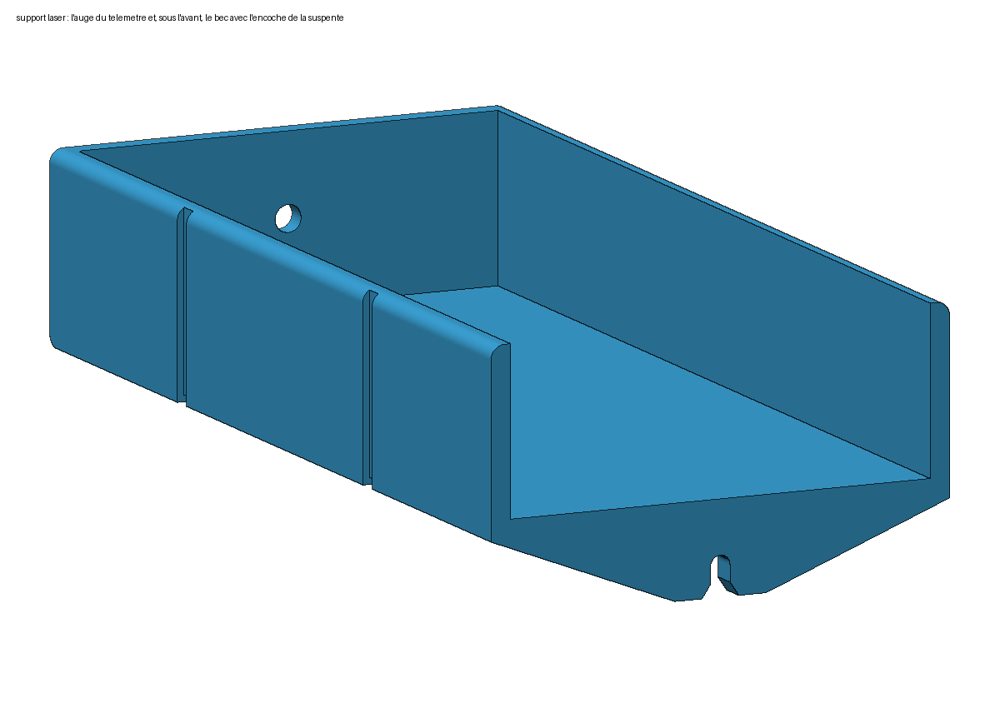

# Paraglider trimming bench

[Version française](README.md)

To check the trim of your wing, every line has to be measured under the same tension. Here,
two 3D-printed parts do the job with a laser distance meter and a 5 L water bag: a **bench**
that sits on the edge of a table and tensions the line to 5 kg, and a **laser holder** that
catches the line's attachment tab at the wing end. Hardware: €30.

| The bench, line under tension | Folded: 164 × 93 × 52 mm | The laser holder and its notch |
|---|---|---|
|  |  |  |

## How it works

- The bench hooks onto the edge of the table. The two **risers** lie flat on it, each on a
  spool; you simply pass the maillon loop over the top.
- A carriage on wheels links the risers, through a cord and a pulley, to the **water bag**
  hanging under the table. As long as the carriage floats between its end stops, the line is
  tensioned to exactly 5 kg.
- In front of the risers, a **white target** flips up and locks square.
- At the wing end, you slide the line into the **notch of the holder**, the tab comes up
  against the stop, and the laser lying in the holder aims at the target. The online trim tool
  does the rest, with the offset given below.
- For travel: target folded down, a hook-and-loop strap around it.

## Files to print

Seven files for the bench, one per part, already oriented for printing, no supports needed;
then the laser holder, in the version for your distance meter.

| File | Part |
|---|---|
| `socle.stl` | the base that hooks onto the table ([image](apercu/socle.png)) |
| `coulisseau.stl` | the carriage that carries the risers and the target ([image](apercu/coulisseau.png)) |
| `cible.stl` | the target, to print in white ([image](apercu/cible.png)) |
| `poulie.stl` | the pulley of the cord ([image](apercu/poulie.png)) |
| `bobine_tete.stl`, `bobine_ecrou.stl` | the two riser spools ([image](apercu/bobine_tete.png)) |
| `entretoises_grappe.stl` | 8 small spacers on a sprue, to cut off with a craft knife ([image](apercu/entretoises_grappe.png)) |

### The laser holder, sized for your distance meter

Same part ([the notch](apercu/support_laser_encoche.png), [seen from below](apercu/support_laser_bec.png)),
one version per distance meter: the Leica DISTO and Bosch models under €500, at the
manufacturer's dimensions plus 0.5 mm of clearance. The holder is 3 mm lower than the
distance meter, so that you can grip it and reach its buttons. Some distance meters only
measure from their rear face: their reading is longer by their own length, and the table
says how much to subtract. GLM 100, 120 and 150: rear pin folded in.

<!-- supports:debut -->
| Distance meter | Manufacturer's dimensions (mm) | Measuring reference | File |
|---|---|---|---|
| Leica DISTO D1 | 115 × 43.5 × 23.5 | rear only: subtract 115 mm from the reading | `support_laser_leica_d1.stl` ([image](apercu/support_laser_leica_d1.png)) |
| Leica DISTO D110 / E7100i | 120 × 37 × 23 | rear only: subtract 120 mm from the reading | `support_laser_leica_d110.stl` ([image](apercu/support_laser_leica_d110.png)) |
| Leica DISTO D2 (v1, 100 m) | 116 × 44 × 26 | front or rear | `support_laser_leica_d2_v1.stl` ([image](apercu/support_laser_leica_d2_v1.png)) |
| Leica DISTO D2 (2025, 150 m) / D2G | 127 × 50.5 × 24.5 | front or rear | `support_laser_leica_d2_2025.stl` ([image](apercu/support_laser_leica_d2_2025.png)) |
| Leica DISTO X1 | 125 × 53.5 × 25.5 | rear only: subtract 125 mm from the reading | `support_laser_leica_x1.stl` ([image](apercu/support_laser_leica_x1.png)) |
| Leica DISTO X3 / X4 | 132 × 56 × 29 | front or rear | `support_laser_leica_x3_x4.stl` ([image](apercu/support_laser_leica_x3_x4.png)) |
| Bosch GLM 40 / GLM 30 | 105 × 41 × 24 | front or rear | `support_laser_bosch_glm40.stl` ([image](apercu/support_laser_bosch_glm40.png)) |
| Bosch GLM 50-22 / 50-25 G / 50-27 C / 50-27 CG / 40-31 | 119 × 53 × 29 | front or rear | `support_laser_bosch_glm50.stl` ([image](apercu/support_laser_bosch_glm50.png)) |
| Bosch GLM 80 | 111 × 51 × 30 | front or rear | `support_laser_bosch_glm80.stl` ([image](apercu/support_laser_bosch_glm80.png)) |
| Bosch GLM 100-25 C / 150-27 C / 120 C | 142 × 64 × 28 | front or rear | `support_laser_bosch_glm100_150.stl` ([image](apercu/support_laser_bosch_glm100_150.png)) |
| Bosch Zamo (IV, 2025) | 104 × 38 × 23 | rear only: subtract 104 mm from the reading | `support_laser_bosch_zamo.stl` ([image](apercu/support_laser_bosch_zamo.png)) |
| Bosch PLM30-21 / EasyDistance 20 | 94 × 36 × 23 | rear only: subtract 94 mm from the reading | `support_laser_bosch_plm30.stl` ([image](apercu/support_laser_bosch_plm30.png)) |
| Bosch PLM40-23 / 50-23 / 60-23C / 70-23C, UniversalDistance 30 / 40C / 50 / 50C, PLR 30 C / 40 C | 100 × 42 × 22 | front or rear | `support_laser_bosch_plm40_70.stl` ([image](apercu/support_laser_bosch_plm40_70.png)) |
| Bosch PLM70-27 / AdvancedDistance 50C / PLR 50 C | 115 × 50 × 23 | front or rear | `support_laser_bosch_plm70_27.stl` ([image](apercu/support_laser_bosch_plm70_27.png)) |
<!-- supports:fin -->

Other distance meter: measure it (width, length, thickness), enter the three dimensions in
`scad/support_laser.scad` and regenerate the STL; `btn_cote` opens a wall facing side
buttons.

## Which material

**PETG**, 4 perimeters, 25 % infill, target in matt white. No PLA: it warps in a car left in
the sun.

If you have it printed by [JLC3DP](https://jlc3dp.com/3d-printing-quote): everything in
**SLS 3201PA-F nylon**, except the target in white **SLA 9000HE resin**. Allow ≈ $44 for the
parts of the bench and ≈ $10 for shipping. The parts clamped by screws or pulled by a line
(base, carriage, laser holder) must not be in resin: it breaks instead of bending.

## What to buy

Nothing but screws and lock nuts, all on AliExpress, from rated sellers. Prices read on
5 October 2026 (M5 × 40 screw, M3 screws and nuts: on the 8th); check the selected variant
before paying. The variant names are those shown on the listings.

| Part | Variant to select | You need | Price | Link |
|---|---|---|---|---|
| Black V wheels Ø 24, bearings fitted | “10PC BigBlack Wheel” | 5 of 10 | €6.69 | [listing](https://fr.aliexpress.com/item/1005003090749056.html) |
| M5 × 25 button head screws (wheels) | “10Pcs M5x25” | 4 of 10 | €4.29 | [listing](https://fr.aliexpress.com/item/32850409234.html) |
| M3 × 12 button head screws (target hinge) | “30Pcs M3x12” | 2 of 30 | €3.69 | [same listing](https://fr.aliexpress.com/item/32850409234.html) |
| M5 × 80 socket head cap screw (spools) | “M5 10 pièces” (10 pieces), then “80 mm” | 1 of 10 | €5.09 | [listing](https://fr.aliexpress.com/item/32968483467.html) |
| M5 × 40 socket head cap screw (pulley axle) | “M5 10 pièces” (10 pieces), then “40 mm” | 1 of 10 | €3.09 | [same listing](https://fr.aliexpress.com/item/32968483467.html) |
| M5 lock nuts with nylon insert | “M5 X 50pcs” | 6 of 50 | €3.39 | [listing](https://fr.aliexpress.com/item/1005002375633274.html) |
| M3 lock nuts with nylon insert | “M3 X 50pcs” | 2 of 50 | €2.26 | [same listing](https://fr.aliexpress.com/item/1005002375633274.html) |
| 2 mm cord | “10 meters” | 1.5 m | €1.62 | [listing](https://fr.aliexpress.com/item/1005011930498059.html) |

**≈ €30 including shipping.** The pulley bearing is taken from the fifth wheel, the weight is
your water bag, and there is no glue and no threadlocker: everything is screwed through
clearance holes, with a lock nut at the end. The laser is not counted: a
30 m Bluetooth distance meter (HOTO QWCJY001 or equivalent) costs €30 to €40.

### The same from Europe

All the fasteners are sold singly by visseriefixations.fr (France). None of the European
shops checked also stocks the wheels: they come from a 3D-printing shop. Prices read on
8 October 2026, shipping not included (it is only shown in the basket).

| Part | Shop reference | You need | Price | Link |
|---|---|---|---|---|
| V wheels Ø 24 × 10 in POM, 5 mm bore, 625ZZ bearings fitted | set of 6 | 5 of 6 | €12.90 | [3delectroshop.fr](https://3delectroshop.fr/roulements-et-rotules/504-roulettes-v-slot-en-pom-avec-roulements-625zz.html) |
| M5 × 25 button head screws, ISO 7380, A2 stainless (wheels) | TBHC05/025A2 | 4 | €0.08 each | [visseriefixations.fr](https://www.visseriefixations.fr/vis-a-six-pans-creux/tete-bombee-hexagonale-creuse/tbhc-inox-a2-iso-7380/tbhc-m5x25-inox-a2-iso-7380.html) |
| M3 × 12 button head screws, ISO 7380, A2 stainless (target hinge) | TBHC03/012A2 | 2 | €0.05 each | [visseriefixations.fr](https://www.visseriefixations.fr/vis-a-six-pans-creux/tete-bombee-hexagonale-creuse/tbhc-inox-a2-iso-7380/tbhc-m3x12-inox-a2-iso-7380.html) |
| M5 × 40 socket head cap screw, DIN 912, A2 stainless (pulley axle) | TCHC05/040A2PF | 1 | €0.13 | [visseriefixations.fr](https://www.visseriefixations.fr/vis-a-six-pans-creux/tete-cylindrique-hexagonale-creuse/inox-a2/tchc-inox-a2-filetage-partiel-din-912/tchc-m5x40-inox-a2-pf-din-912.html) |
| M3 lock nuts with nylon insert, DIN 985, A2 stainless | ECRNYL03A2 | 2 | €0.04 each | [visseriefixations.fr](https://www.visseriefixations.fr/ecrous/ecrous-autofreines/ecrou-hexagonal-autofreine-nylstop/ecrou-nylstop-inox-a2-din-985/ecrou-nylstop-m3-inox-a2-din-985-17062-17062.html) |
| M5 lock nuts with nylon insert, DIN 985, A2 stainless | ECRNYL05A2 | 6 | €0.04 each | [visseriefixations.fr](https://www.visseriefixations.fr/ecrous/ecrous-autofreines/ecrou-hexagonal-autofreine-nylstop/ecrou-nylstop-inox-a2-din-985/ecrou-nylstop-m5-inox-a2-din-985-99867-99867.html) |
| M5 × 80 socket head cap screw, DIN 912, A2 stainless (spools) | TCHC05/080A2PF | 1 | €0.59 | [visseriefixations.fr](https://www.visseriefixations.fr/vis-a-six-pans-creux/tete-cylindrique-hexagonale-creuse/inox-a2/tchc-inox-a2-filetage-partiel-din-912/tchc-m5x80-inox-a2-pf-din-912.html) |

**Fasteners: €1.46, plus shipping; wheels: €12.90, plus shipping.** The cord is any 2 mm
cord.

## Assembly

The full diagram, with the hardware (labels in French): [schema_montage.png](apercu/schema_montage.png).

1. **Pulley**: take a bearing out of a spare wheel and press it into the pulley. Place the
   pulley in its slot with a spacer on each side. Slide an M5 lock nut into its pocket, on one
   side of the base, pass the M5 × 40 screw through from the other side and screw it in (4 mm
   hex key) until the head seats, without forcing. Head and nut stay below the sides.
2. **Wheels**: a lock nut in each of the 4 pockets of the carriage, then for each wheel an
   M5 × 25 screw from underneath, through the wheel and a spacer.
3. **Play**: tighten the fixed side, push the two other wheels to the bottom of their groove
   (slotted holes), tighten. The carriage must roll by itself when you tilt the base.
4. **Spools**: on the M5 × 80 screw, one spool, the rib of the carriage, the other spool, the
   lock nut in the cap. Leave it alone from then on.
5. **Target**: slide an M3 lock nut into the pocket of each lug of the carriage, on the inner
   side, then place the target between the lugs: it keeps the nuts in. On each side, screw an
   M3 × 12 screw through the lug (2 mm hex key) until its head seats. The end of the screw is
   the axle of the target.
6. **Cord**: figure-eight knot in the well behind the target; the cord runs in the channel of
   the base, goes over the pulley and is tied to the handle of the bag. Weigh the full bag at
   **5.00 kg**.

Adjust the cord so that the bag rests on the floor when the line is slack, and lifts off as
soon as you pull.

## Setting the offset in the trim tool

The tool asks for the distance between the attachment point of the riser and the target. On
the bench, the whole riser is held on the spool: the axis of its screw is **21 mm** from the
face of the target, on the laser side.

**Offset to enter: 21 mm.**

Set the distance meter to measure **from its front face**: it sits flush with the nose of the
holder.

## Going further

- [NOTES.md](https://github.com/alexandre-pereira/trimming-tools/blob/main/NOTES.md) (in
  French): design choices, dimensions, prices recorded, variants set aside and what has been
  checked.
- The OpenSCAD models are in `scad/`, the scripts that regenerate the STL files, the images
  and this site in `outils/`. Repository: <https://github.com/alexandre-pereira/trimming-tools>,
  site: <https://trimming-tools.weflare.fr>.
- Nothing has been printed or tried under load yet: this is a model, not a tested product.
