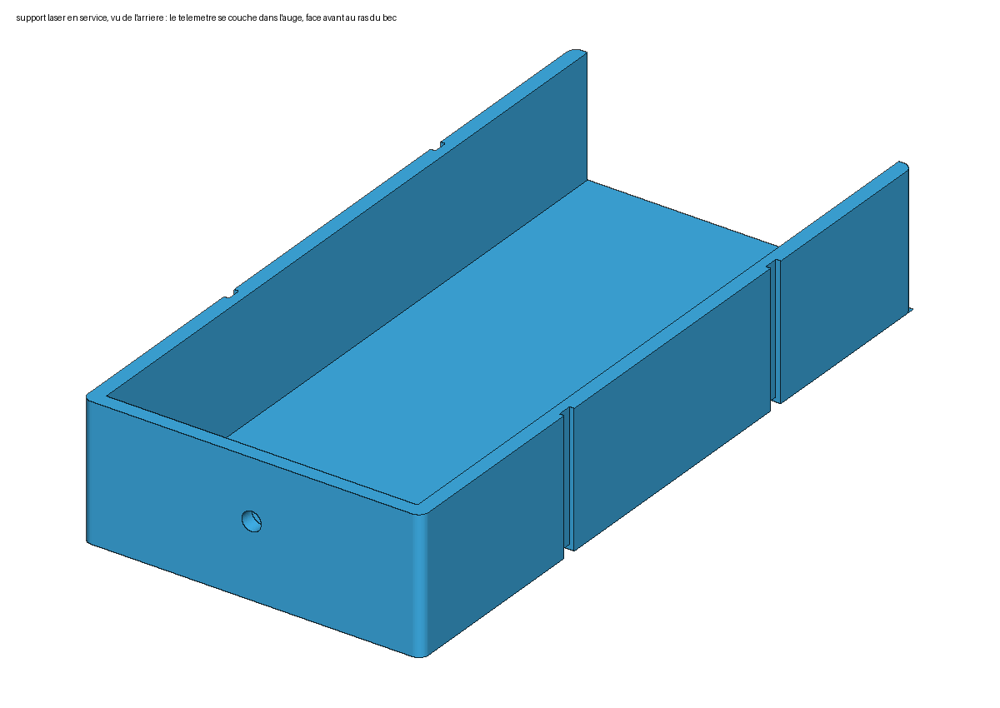

# Banc de calage parapente

Deux pièces imprimées en 3D pour mesurer les suspentes d'une voile au télémètre laser :
un **banc** qui se pose sur le bord d'une table et tend la suspente sous 5 kg (poche à eau),
et un **support de laser** qui coince la patte d'attache côté voile. Quincaillerie ≈ 27 €,
plastique ≈ 130 g.

| Le banc en service | Le banc plié (164 × 93 × 52 mm) | Le support du laser |
|---|---|---|
|  |  |  |

## Comment ça marche

- Le **socle** s'accroche au chant de la table. Un **coulisseau** roule dessus sur 4 roues
  en V, sur 100 mm de course.
- Les deux **élévateurs** s'accrochent à l'avant du coulisseau, à plat, chacun sur une bobine.
- Une **cordelette** relie l'arrière du coulisseau, par une poulie, à une **poche à eau de
  5 kg** qui pend sous la table : quand le coulisseau flotte entre ses butées, la suspente
  est tendue à exactement 5 kg.
- Une **cible blanche** articulée se relève à l'avant du coulisseau et se verrouille
  d'équerre ; elle se rabat pour le transport.
- Côté voile, le **support du laser** coince la patte d'attache de la suspente dans l'encoche
  de son bec ; le télémètre couché dedans vise la cible. **Longueur = lecture + constante**,
  la constante étant étalonnée une fois au mètre ruban.

## Fichiers à imprimer

Un fichier par pièce, orienté pour l'impression, sans support, en millimètres.

| Fichier | Pièce | Aperçu |
|---|---|---|
| `socle.stl` | socle, crochets de table, logement de la poulie | [image](apercu/socle.png) |
| `coulisseau.stl` | coulisseau, couloirs des élévateurs, oreilles de la cible | [image](apercu/coulisseau.png) |
| `cible.stl` | cible articulée, mire gravée | [image](apercu/cible.png) |
| `poulie.stl` | poulie Ø25 | [image](apercu/poulie.png) |
| `bobine_tete.stl` | bobine d'élévateur, côté tête de vis | [image](apercu/bobine_tete.png) |
| `bobine_ecrou.stl` | bobine d'élévateur, côté écrou | [image](apercu/bobine_ecrou.png) |
| `entretoises_grappe.stl` | 8 entretoises sur une barrette, à détacher au cutter | [image](apercu/entretoises_grappe.png) |
| `support_laser.stl` | support du télémètre, avec son bec à encoche | [image](apercu/support_laser.png), [le bec](apercu/support_laser_bec.png) |

**Support du laser : mettez les cotes de votre télémètre** dans `scad/support_laser.scad`
(`laser_w`, `laser_l`, `laser_h` : largeur, longueur, épaisseur) et regénérez le STL. Les
parois s'arrêtent 3 mm sous le dessus du télémètre ; `btn_cote`, `btn_y0` et `btn_len`
dégagent une paroi en face de boutons placés sur le côté. L'encoche fait 3 mm de large.

## Quelle matière

| Pièce | Chez vous ou au fablab | Chez JLC3DP |
|---|---|---|
| Socle, cible | PETG | résine SLA 9000HE, blanc |
| Coulisseau, poulie, bobines, entretoises, support du laser | PETG | nylon SLS 3201PA-F |

PETG (ou ASA), 4 périmètres, 25 % de remplissage, cible en blanc mat. Pas de PLA : il se
déforme dans une voiture au soleil. Pas de résine pour les pièces qui serrent des goupilles
ou travaillent en tension (coulisseau, support du laser).

## Ce qu'il faut acheter

Tout sur AliExpress, annonces notées. Prix lus le 5 octobre 2026 ; vérifiez la variante
cochée avant de payer.

| Pièce | Variante à cocher | Qté utile | Prix | Lien |
|---|---|---|---|---|
| Roues V noires Ø 24 avec leurs 2 roulements 625 | « 10PC BigBlack Wheel » | 5 sur 10 | 6,69 € | [annonce](https://fr.aliexpress.com/item/1005003090749056.html) |
| Vis M5 × 25 tête bombée, ISO 7380 | « 10Pcs M5x25 » | 4 sur 10 | 4,29 € | [annonce](https://fr.aliexpress.com/item/32850409234.html) |
| Écrous frein M5 à bague nylon, DIN 985 | « M5 X 50pcs » | 5 sur 50 | 3,39 € | [annonce](https://fr.aliexpress.com/item/1005002375633274.html) |
| Vis M5 × 80 tête cylindrique, DIN 912 | « M5 10 pièces », puis « 80 mm » | 1 sur 10 | 5,09 € | [annonce](https://fr.aliexpress.com/item/32968483467.html) |
| Goupille lisse Ø 5 × 40, axe de poulie | « M5 10pcs », puis « 40mm » | 1 sur 10 | ≈ 1,50 € | [annonce](https://fr.aliexpress.com/item/1005004143852668.html) |
| Goupilles lisses Ø 3 × 12, charnières | « M3 25pcs », puis « 12mm » | 2 sur 25 | ≈ 1,50 € | [même annonce](https://fr.aliexpress.com/item/1005004143852668.html) |
| Cordelette 2 mm | « 10 meters » | 1,5 m | 1,62 € | [annonce](https://fr.aliexpress.com/item/1005011930498059.html) |

**≈ 27 € port compris.** Le roulement de la poulie se prend sur la cinquième roue ; le lest est
votre poche à eau de 5 L ; il n'y a ni colle ni frein-filet. Le télémètre n'est pas compté :
un modèle Bluetooth de 30 m (HOTO QWCJY001 ou équivalent) se trouve entre 30 et 40 €.

## Imprimer soi-même

- **Chez vous ou au fablab** : PETG, 0,2 mm de couche, 4 périmètres, 25 % de remplissage,
  pas de support. Plateau de 180 mm minimum (le socle fait 164 × 80 mm). Une dizaine
  d'heures en tout, ≈ 130 g.
- **Chez JLC3DP** : créer un compte sur [jlc3dp.com/3d-printing-quote](https://jlc3dp.com/3d-printing-quote),
  déposer les 8 STL, choisir pour chacun la matière du tableau ci-dessus. Compter ≈ 30 $ de
  pièces et ≈ 10 $ de port.
- **À vérifier à l'impression** : les goupilles doivent entrer à force dans leurs trous à six
  pans ; le coulisseau doit rouler seul d'une butée à l'autre quand on incline le socle.

## Montage

Schéma complet avec la visserie : [schema_montage.png](apercu/schema_montage.png).

1. **Poulie** : chasser un roulement 625 d'une roue en trop, l'emmancher dans la poulie.
   Poser la poulie dans sa fente avec une entretoise de chaque côté, enfoncer la goupille
   Ø5 × 40 à travers les deux crochets jusqu'à ce qu'elle soit en retrait des flancs.
2. **Roues** : un écrou frein dans chacun des 4 logements du coulisseau, puis pour chaque roue
   une vis M5 × 25 par le dessous, à travers la roue et une entretoise.
3. **Jeu des roues** : serrer le côté fixe, pousser les deux autres roues au fond de leur
   rainure (trous oblongs), serrer. Le coulisseau doit rouler seul quand on incline le socle.
4. **Bobines** : enfiler sur la vis M5 × 80 une bobine, la nervure centrale, l'autre bobine ;
   écrou frein dans le chapeau, serrer. Définitif.
5. **Cible** : entre les oreilles, une goupille Ø3 × 12 de chaque côté, enfoncée à ras.
6. **Cordelette** : nœud en huit dans le puits derrière la cible, le brin descend dans le canal
   du socle, passe sur la poulie, se noue à la poignée du lest. Peser le lest à **5,00 kg**.

## Utilisation

1. Socle sur la table, crochets contre le chant. Relever la cible et la pousser vers le bas
   jusqu'à ce qu'elle se verrouille.
2. Régler la cordelette pour que la poche **repose au sol** quand la suspente est relâchée.
3. Passer la boucle de base de chaque élévateur par-dessus le chapeau de sa bobine, coucher
   la sangle dans son couloir.
4. Côté voile, glisser la suspente dans l'encoche du support, patte en butée contre le bec.
   Reculer jusqu'à ce que la poche décolle et que le coulisseau flotte entre ses butées.
5. Viser le trait horizontal de la mire, lire, noter `lecture + K`. Trois lectures par suspente.

**Étalonnage de K** : tendre une suspente sur le banc, la mesurer au mètre ruban acier de la
bobine à la patte, lire le laser au même moment : `K = ruban − laser`. Moyenne sur trois
suspentes.

**Transport** : cible rabattue, cordelette enroulée, une sangle velcro autour du bloc.

## Pour aller plus loin

- [NOTES.md](https://github.com/alexandre-pereira/trimming-tools/blob/main/NOTES.md) :
  choix de conception, cotes, prises de filet, prix relevés, variantes écartées, ce qui a été
  vérifié et ce qui ne l'a pas été.
- Modèles paramétriques OpenSCAD : `scad/banc.scad`, `scad/support_laser.scad`. Les scripts de
  `outils/` regénèrent STL, images, schémas et ce site.
- Dépôt : <https://github.com/alexandre-pereira/trimming-tools>. Rien n'a encore été
  imprimé ni essayé en charge : c'est un modèle, pas un produit testé.
